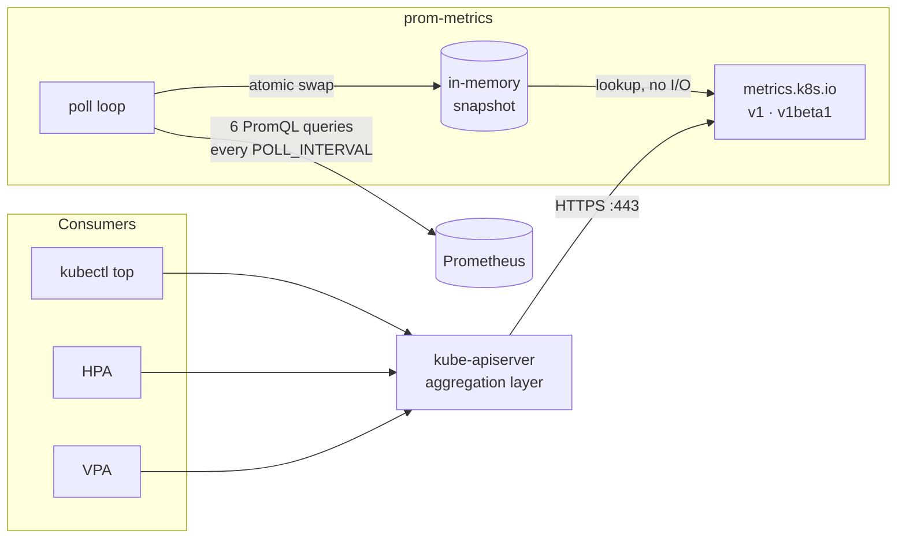

# prom-metrics

A tiny Rust binary that serves the Kubernetes **Resource Metrics API**
(`metrics.k8s.io`) from an existing Prometheus — a drop-in replacement for
`metrics-server`. `kubectl top`, HPA and VPA keep working; the data comes from
the Prometheus you already run. It is **not** a Prometheus Adapter: no rules, no
custom/external metrics.



## Requirements

- Prometheus scrapes cAdvisor with `namespace`, `pod`, `container` labels, and
  the root cgroup (`id="/"`) carries `node` (true for `kube-prometheus-stack`).
- Prometheus is reachable over plain `http://` (the binary has no TLS client).
- `CPU_RATE_WINDOW` ≥ 2 × scrape interval, otherwise CPU reads `0m`.
- metrics-server is uninstalled; only one provider can own `metrics.k8s.io`.
- Optional: kube-state-metrics, for `labelSelector` support.

## Install

```sh
helm upgrade --install prom-metrics oci://ghcr.io/justiniven/charts/prom-metrics \
  -n kube-system --set prometheus.url=http://prometheus-operated.monitoring.svc:9090

kubectl get apiservices | grep metrics.k8s.io   # Available=True
kubectl top nodes
```

The chart defaults to 2 replicas, a PDB, `system-cluster-critical`, a
Helm-generated CA with a verified APIService, and supports cert-manager or an
existing Secret. See [charts/prom-metrics/README.md](charts/prom-metrics/README.md)
for all values. Plain manifests are in [deploy/](deploy/).

## Configuration

Environment variables (the chart maps them to values):

| Variable | Default | Meaning |
| --- | --- | --- |
| `PROMETHEUS_URL` | `http://prometheus:9090` | Prometheus base URL |
| `POLL_INTERVAL` | `15s` | snapshot refresh period and query timeout |
| `MAX_METRICS_AGE` | `60s` | older snapshots answer `503`; keep ≥ 3 × `POLL_INTERVAL` |
| `CPU_RATE_WINDOW` | `60s` | `rate()` window, reported as `window` |
| `LISTEN_ADDR` | `0.0.0.0:8443` | bind address |
| `TLS_CERT_FILE` / `TLS_KEY_FILE` | `/var/run/serving-cert/tls.{crt,key}` | serving certificate |
| `RUST_LOG` | `info` | log level |

Durations: `500ms`, `15s`, `2m`, `1h`, or bare seconds. Invalid values fail
startup. For a 30s scrape interval use `CPU_RATE_WINDOW=120s`,
`POLL_INTERVAL=30s`, `MAX_METRICS_AGE=150s`.

TLS is on when both files exist. If neither variable is set and the defaults are
absent, it serves plain HTTP (local use only). If a variable is set and the file
is missing, startup fails. Certificates are **not reloaded** — restart after
rotation (the chart does this automatically for `tls.type=helm`).

## Security

- **No authn/authz on the backend.** Anything reaching port 8443 can read
  cluster-wide usage. Restrict it with `networkPolicy.enabled=true`.
- **No Kubernetes credentials.** No ServiceAccount token, no RBAC; a compromised
  pod gets no API access.
- **No query injection.** Only six fixed queries run; client input never reaches
  PromQL. Path parameters are validated as Kubernetes names.
- **Minimal image.** `FROM scratch`, static musl binary, no shell. Runs as UID
  65532, read-only root, all capabilities dropped, `RuntimeDefault` seccomp —
  passes the `restricted` Pod Security Standard.
- **No secrets in logs.** Prometheus errors are logged without the URL.
- Pin `image.digest` in regulated environments; rebuild to pick up advisories.

## High availability

Replicas are stateless and independent: no leader election, nothing to lose on
restart. Each replica adds 6 queries per poll to Prometheus. Replicas poll on
their own schedule, so `timestamp` can differ by up to one `POLL_INTERVAL`
between requests — harmless for the HPA.

With one replica, a rollout or drain briefly makes `metrics.k8s.io` unavailable;
HPAs hold their last decision rather than scaling. The chart's 2 replicas,
`maxUnavailable: 0`, PDB and topology spread remove that gap.

**Prometheus is the real single point of failure.** During an outage the last
snapshot is served until `MAX_METRICS_AGE`, then `503` — stale data is never
presented as current. Liveness ignores Prometheus, so outages don't cause
restart loops.

## Sizing

Measured on kind v1.37.0: 1.4 MiB RSS, 1m CPU, 4.1 ms per full refresh,
~1 ms per `/pods` request, 3.27 MB image. Default requests `10m`/`32Mi`, limit
`64Mi` memory; raise the memory limit above a few thousand pods. Avoid CPU
limits — throttling only adds latency. Prometheus load is fixed per poll, but
query cost grows with cardinality; watch the refresh duration.

## Observability

- `/livez`, `/healthz`: process alive. `/readyz`: first snapshot collected.
- `/metrics`: `metrics_adapter_prometheus_query_duration_seconds`,
  `_prometheus_query_errors_total`, `_last_successful_refresh_timestamp_seconds`,
  `_cached_pods`, `_cached_nodes`. Enable `serviceMonitor` and `prometheusRule`
  in the chart for scraping and alerts.
- Logs: config at startup, `initial metrics snapshot ready`, and
  `prometheus refresh failed` on each failed poll. `RUST_LOG=debug` logs every refresh.

## Troubleshooting

| Symptom | Cause |
| --- | --- |
| `Metrics API not available` | APIService missing or no Ready pod |
| APIService `Available=False`, TLS error | cert SAN isn't `<svc>.<ns>.svc`, or wrong `caBundle` |
| `503` everywhere | no successful refresh within `MAX_METRICS_AGE`; check logs |
| Pod never Ready | first poll failing; is `PROMETHEUS_URL` reachable? |
| No pods / no nodes | cAdvisor series lack `namespace`/`pod`/`container` / `node` labels |
| CPU always `0m` | `CPU_RATE_WINDOW` < 2 × scrape interval |
| `labelSelector` ignored | no `kube_pod_labels`; filtering fails open |
| `400` on selector | set-based (`in`, `notin`) is unsupported |

## API behaviour

- `v1` and `v1beta1` of `nodes` and `pods` (`get`, `list`, namespaced and
  cluster-wide); errors are `metav1.Status`.
- CPU in millicores (`250m`), memory with the largest exact binary suffix
  (`64Mi`); `window` equals `CPU_RATE_WINDOW`.
- `labelSelector` supports `a=b`, `a!=b`, `a`, `!a`, matched against
  kube-state-metrics labels (keys sanitised like `label_app_kubernetes_io_name`).
- Pause containers and series without identifying labels are dropped; missing
  CPU or memory samples report `0`; terminated containers vanish within one window.

Queries (`$w` = `CPU_RATE_WINDOW`):

```promql
sum by (namespace, pod, container) (rate(container_cpu_usage_seconds_total{container!="", container!="POD"}[$w]))
sum by (namespace, pod, container) (last_over_time(container_memory_working_set_bytes{container!="", container!="POD"}[$w]))
sum by (node) (rate(container_cpu_usage_seconds_total{id="/"}[$w]))
sum by (node) (last_over_time(container_memory_working_set_bytes{id="/"}[$w]))
last_over_time(kube_pod_labels[$w])
last_over_time(kube_node_labels[$w])
```

## Development

```sh
cargo test                     # unit + integration tests, Prometheus mocked
cargo build --release
docker build -t prom-metrics .
PROMETHEUS_URL=http://localhost:9090 LISTEN_ADDR=127.0.0.1:8080 cargo run   # plain HTTP
helm lint charts/prom-metrics
```

Not implemented by design: custom/external metrics, configurable rules, CRDs,
leader election, authn/authz, certificate reloading.
